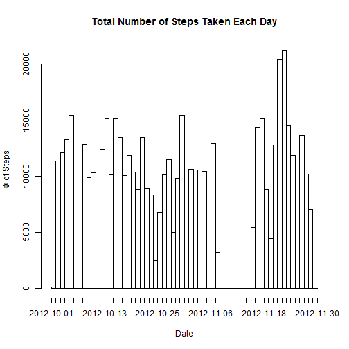
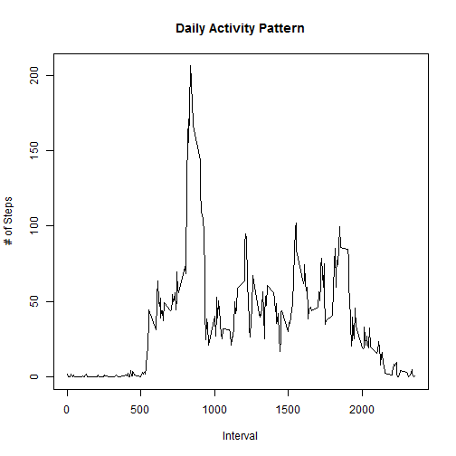
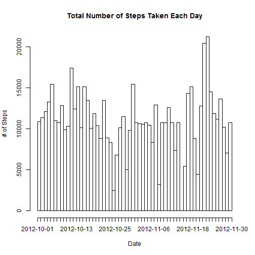
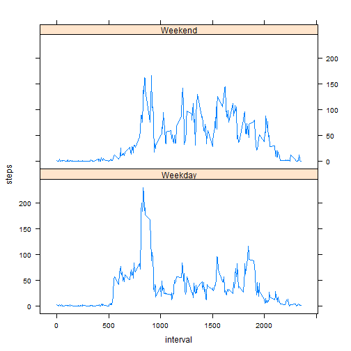

#Reproducible Research Peer Assement 1

My Name: Akihiro Hayashi


##Step 1: Loading and preprocessing the data

Load the data with read.csv() function.


```r
library(knitr)
act <- read.csv("activity.csv", header = TRUE)

## Change the class of file$steps for coming analysis.
act[, 1] <- as.numeric(act[, 1])
```


##Step 2: What is mean total number of steps taken per day?

2-1. Calculate the total number and mean of steps taken per day


```r
## Calculate total steps and mean steps of each day.
sum.steps <- tapply(act$steps, act$date, FUN = sum, na.rm = TRUE, simplify = TRUE)
mean.steps <- tapply(act$steps, act$date, FUN = mean, na.rm = TRUE, simplify = TRUE)

## Combine sum & mean data into a new data.frame
new.act <- data.frame(date = as.vector(unique(act$date)), sum = sum.steps, mean = mean.steps)
rownames(new.act) = NULL

mean.total <- mean(new.act$sum)
median.total <- median(new.act$sum)
```

Conclusion 2.1:

* The mean of the total number of steps taken per day is 9354.2295082.
* The median of the total number of steps taken per day is 1.0395 &times; 10<sup>4</sup>.


2-2. Plot a histogram of the total number of steps taken each day


```r
daily.count <- rep(1:61, new.act$sum)
hist(daily.count, 1:61, xaxt = "n", main = "Total Number of Steps Taken Each Day", xlab = "Date", ylab = "# of Steps")
axis(side = 1, at = 1:61, label = new.act$date)
```

 


##Step 3: What is the average daily activity pattern?


```r
d.act <- aggregate(steps ~ interval, data = act, FUN = mean)
plot(d.act, type = "l", xlab = "Interval", ylab = "# of Steps", main = "Daily Activity Pattern")
```

 


```r
M.interval <- d.act[which(d.act$steps == max(d.act$steps)), 1]
```

Report: The 835 contains the maximum number of steps.


##Step 4: Imputing missing values

3.1: Calculate and report the total number of missing values in the dataset.


```r
num.na <- sum(is.na(act))
```

There are 2304 in the dataset.


3.2: Fill missing data with mean of daily activity and make new plot with new dataset.


```r
##Replace missing values with mean of daily activity.
act2 <- act
for(i in 1:nrow(act2)) {
        if(is.na(act2$steps[i])) {
                act2[i, 1] <- d.act[which(d.act[, 1] == act2[i, 3]), 2]
                i <- i + 1
        }
}
```


```r
##Again, calculate new total steps and mean steps of each day.
sum.steps2 <- tapply(act2$steps, act2$date, FUN = sum, na.rm = TRUE, simplify = TRUE)
mean.steps2 <- tapply(act2$steps, act2$date, FUN = mean, na.rm = TRUE, simplify = TRUE)
##Also, make a new file.
new.act2 <- data.frame(date = as.vector(unique(act2$date)), sum = sum.steps2, mean = mean.steps2)
rownames(new.act) = NULL
##Make new histogram.
daily.count <- rep(1:61, new.act2$sum)
hist(daily.count, 1:61, xaxt = "n", main = "Total Number of Steps Taken Each Day", xlab = "Date", ylab = "# of Steps")
axis(side = 1, at = 1:61, label = new.act$date)
```

 

```r
##Calcualte the mean and median of the total number of steps taken per day.
mean.total2 <- mean(new.act2$sum)
median.total2 <- median(new.act2$sum)
```

Conclusion 3.2:

* The mean of the total number of steps taken per day is 1.0766189 &times; 10<sup>4</sup>.
* The median of the total number of steps taken per day is 1.0766189 &times; 10<sup>4</sup>.


It doesn't seem so much impact after we filled in missing values. Only the first day and last number of steps apparently increased.


##Step 5: Are there differences in activity patterns between weekdays and weekends?


```r
week <- vector(mode = "character")
week.det <- weekdays(as.Date(act2$date))
for(i in 1:17568) {
        if(week.det[i] == "Saturday") {
                week[i] <- "Weekend"
        } else if (week.det[i] == "Sunday") {
                week[i] <- "Weekend"
        } else {
                week[i] <- "Weekday"
        }
        i = i + 1
}
act2[, 4] <- week; colnames(act2)[4] <- "week"
d.act2 <- aggregate(steps ~ interval+week, data = act2, FUN = mean)

library(lattice)
xyplot(steps ~ interval | week, data = d.act2, type = "l", layout = c(1, 2))
```

 


Observation:

1. On the weekend, we can easily find out that the number of steps of this person spread more evenly.

2. This person tend to start/finish walking much earlier on the weekday than weekend.
